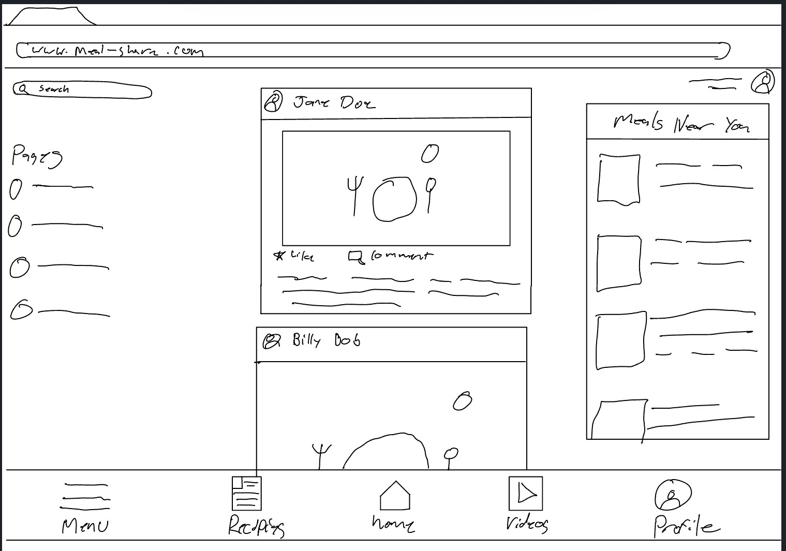
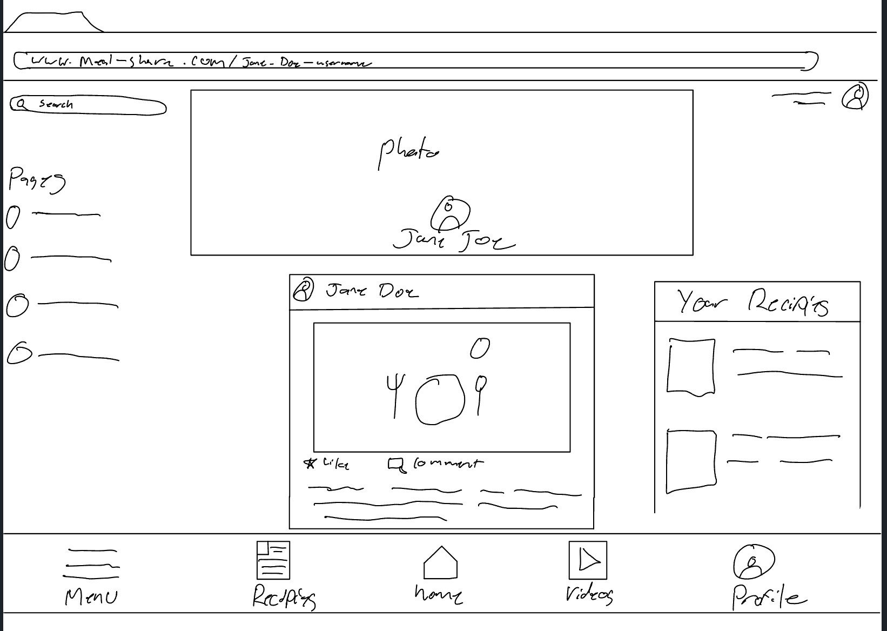
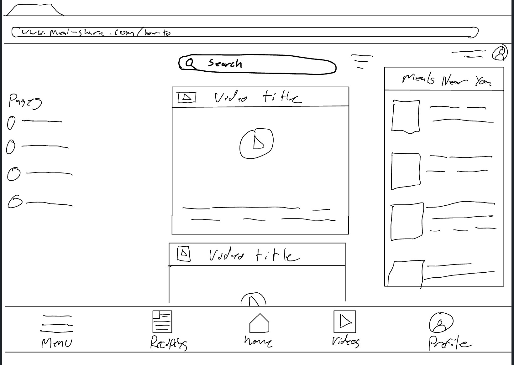
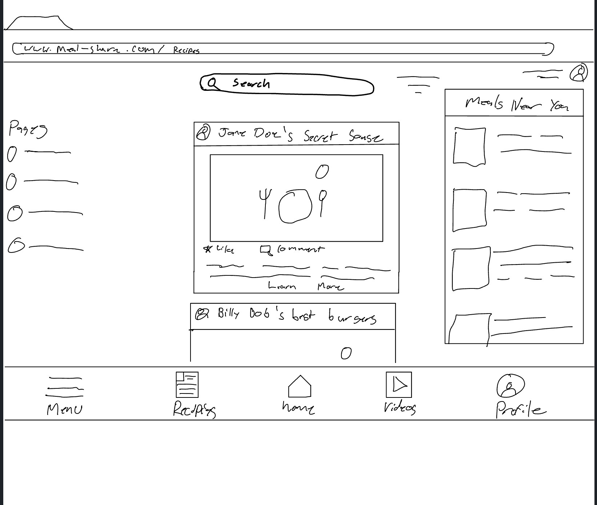

# Meal Share

[My Notes](notes.md)
## Meal Share Introduction

Meal Share is a social media platform that allows people to share meals, recipes, and other foods. This platform will provide a place for people to share their food with their communities. People can use this platform to launch their culinary businesses. This platform will give users the ability to peruse different posts about meals, post about the foods they enjoy making, access how-to videos, save and share family recipes, host live and digital events, buy or sell culinary delights, participate in or host classes, and get to know others in their communities. Nothing brings people together like food. The main income for this platform will be from individuals and businesses advertising products and services to nonpaying users.


> [!NOTE]
>  This is a template for your startup application. You must modify this `README.md` file for each phase of your development. You only need to fill in the section for each deliverable when that deliverable is submitted in Canvas. Without completing the section for a deliverable, the TA will not know what to look for when grading your submission. Feel free to add additional information to each deliverable description, but make sure you at least have the list of rubric items and a description of what you did for each item.

> [!NOTE]
>  If you are not familiar with Markdown then you should review the [documentation](https://docs.github.com/en/get-started/writing-on-github/getting-started-with-writing-and-formatting-on-github/basic-writing-and-formatting-syntax) before continuing.

## 🚀 Specification Deliverable

> [!NOTE]
>  Fill in this sections as the submission artifact for this deliverable. You can refer to this [example](https://github.com/webprogramming260/startup-example/blob/main/README.md) for inspiration.

For this deliverable I did the following. I checked the box `[x]` and added a description for things I completed.

- [x] Proper use of Markdown
- [x] A concise and compelling elevator pitch
- [x] Description of key features
- [x] Description of how you will use each technology
- [x] One or more rough sketches of your application. Images must be embedded in this file using Markdown image references.

### Elevator pitch

Food and social media are the most powerful community builders. So I decided to combine the two. Meal Share is a social media platform built around sharing food, recipes, and cultures, and will also provide a place to launch and support culinary businesses. Users will create a profile where they can save and access recipes, like and comment on others' posts, make posts about their culinary adventures, access how-to videos, and expand their culinary horizons. Users will be encouraged to make extra food and sell it to their neighbors. Imagine if a ride-sharing app like Uber and a social media platform like Instagram teamed up to build society through food that is Meal Share.


### Design




```
Home page layout of MealShare.com
```





```
Profile page layout of MealShare.com
```





```
How-To video page layout of MealShare.com
```





```
Recipe page layout of MealShare.com
```


### Key features

- A main feed where users view posts from people and groups they follow.
- A how-to video page where users can search for videos to help in their culinary adventures.
- A profile page with relevant information about the user such as posts, recipes, A list of the users alergies, and followers/people they follow.
- A Find-A-Meal page where users can find available home-cooked meals in their area.
- Recommended for you/Food Near you (IP Stack WebApi where we gather users' interests and location based on their IP address)
- Search bar used to find people, businesses, pages, recipies, food. The user will be notified if an item has alergens they marked when they created a profile.
- Business/group page creation.
- Ingredient Analyzer (Open Food Facts API)


### Technologies

I am going to use the required technologies in the following ways.

- **HTML** - HTML will be used to create and format all of the pages mentioned in the key features list. It will also be used to format the profile creating page, the login page, and provide hyperlinks to navigate the social media platform. HTML will also be used to access different web pages such as google maps.  
- **CSS** - CSS will be used to ensure coherent and consistent styling for all pages.  
- **React** - Users will be able to interact with like, comment, and search buttons. They will also be able to select a user's profile or name to view the other user's profile page. There will also be a navigation bar so they can quickly switch between their feed, available meals page, their profile page, how-to video page, or create a post. The user will also be able to click on a button access the menu where they can create a group or business page. From the business page users can access the advertising interface. 
- **Service** - Back-end service with endpoints for:
  - Search results
  - Ingredient analysis
  - Advertising interface
  - User authentication
  - feed management
  - Post creation and formatting
  - advertising analytics
  - Retrieving purchased meal status (being prepared, ready for pick-up)
- **DB/Login** - Store users, user preferences, posts, videos, groups, businesses, registers, and login users, user/business location, User friends, Credentials, and payment info stored securely in the database, 
- **WebSocket** - Broadcasts posts, comments, likes, purchase requests, events, and created group and business pages for other users to view.

## 🚀 AWS deliverable

For this deliverable I did the following. I checked the box `[x]` and added a description for things I completed.

- [x] **Server deployed and accessible with custom domain name** - [My server link](https://yourdomainnamehere.click).

## 🚀 HTML deliverable

For this deliverable I did the following. I checked the box `[x]` and added a description for things I completed.

- [x] **HTML pages** - I created 10 html pages with index.html as the login page.
- [x] **Proper HTML element usage** - I worked on the formating to the best of my abilities and updated the elements of each page as necessary.
- [x] **Links** - I made links between each of the pages.
- [x] **Text** - I have little descriptions of elements I don't know how to add and texts as place holders.
- [x] **3rd party API placeholder** - I have a place holder for google maps.
- [x] **Images** - I have place holder images for different elements like posts, recipes, and meals.
- [x] **Login placeholder** - see deliverable 1.
- [x] **DB data placeholder** - posts will be saved in the DB and randomly added to users feeds as the scroll.
- [x] **WebSocket placeholder** - I did complete this part of the deliverable.

## 🚀 CSS deliverable

For this deliverable I did the following. I checked the box `[x]` and added a description for things I completed.

- [x] **Header, footer, and main content body** - Made all of the pages uniform and added elements to differentiate between pages.
- [x] **Navigation elements** - All navigation elements function. I changed the format of buttons.
- [x] **Responsive to window resizing** - I tested resizing by moving the window around and resizing the window
- [x] **Application elements** - Added comment and like buttons. I have not yet figured out how to add live maps for my third party api. I also need to make procedural post generation for feeds/search results and all other elements. We have not covered how to do this. We also have not covered how to make interactable elements and I tried to insert as many placeholders for these elements as possible.
- [x] **Application text content** - set place holders for all text elements
- [x] **Application images** - I have place holder photos where ever photos will be

## 🚀 React part 1: Routing deliverable

For this deliverable I did the following. I checked the box `[x]` and added a description for things I completed.

- [x] **Bundled using Vite** - I used vite and npm to debug my code.
- [x] **Components** - I completed this part of the deliverable. All pages are accessible and interactable
- [x] **Router** - Routing between login and voting components.

## 🚀 React part 2: Reactivity

For this deliverable I did the following. I checked the box `[x]` and added a description for things I completed.

- [x] **All functionality implemented or mocked out** - Username password and posts persist in local storage. Can create new posts for websocket. Third party api is mocked up as an inspirational cooking quote on login screen
- [x] **Hooks** - Professor Jensen said to focus on post functionality. I used the hooks to login and create new posts. 

## 🚀 Service deliverable

For this deliverable I did the following. I checked the box `[x]` and added a description for things I completed.

- [x] **Node.js/Express HTTP service** - Tested with curl and online.
- [x] **Static middleware for frontend** - Authetication for posting and loading new posts done in backend.
- [x] **Calls to third party endpoints** - Loads photos from foodish-api.com.
- [x] **Backend service endpoints** - Index.js in service has endpoints to register, login, logout, get posts, get users, add posts.
- [x] **Frontend calls service endpoints** - Posts now are created then sent to the backend using fetch. Login, register, and logout called using fetch. Posts are dynamically loaded from backend using fetch.

## 🚀 DB/Login deliverable

For this deliverable I did the following. I checked the box `[x]` and added a description for things I completed.

- [x] **User registration** - cannot login without first registering
- [x] **User login and logout** - Authtoken is added or removed on login and logout.
- [x] **Stores data in MongoDB** - Mongo stores all data for posts, meals, recipes, and pages.
- [x] **Stores credentials in MongoDB** - mongo stores all data for users.
- [x] **Restricts functionality based on authentication** - Cannot access any other pages without authorization

## 🚀 WebSocket deliverable

For this deliverable I did the following. I checked the box `[x]` and added a description for things I completed.

- [x] **Backend listens for WebSocket connection** - Keeps track of everyone that is currently online and sends notifications when their post is liked.
- [x] **Frontend makes WebSocket connection** - Sends and receives messages from the server about liked posts.
- [x] **Data sent over WebSocket connection** - Message about who liked your post.
- [x] **WebSocket data displayed** - When someone likes your post the notification shows up on the home page.
- [x] **Application is fully functional** - The application is functional within the bounds of this class. I will add more functionality over time.
